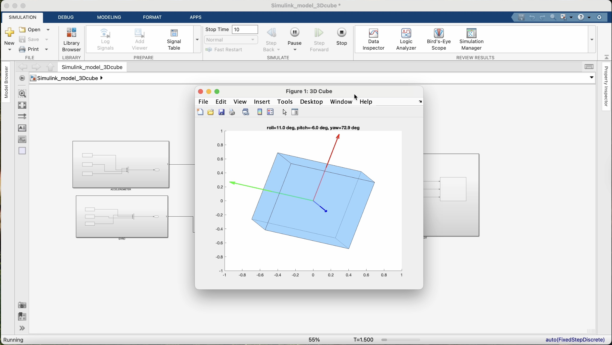

# 3D Orientation Estimation and Visualization using Kalman Filter in Simulink

This project focuses on estimating the 3D orientation of an object (roll, pitch, yaw) using real-world IMU data (accelerometer and gyroscope) collected from my mobile phone. The orientation is estimated using three separate Kalman filters and visualized as a rotating cube in 3D space with directional arrows. Every part of the system — from data acquisition, Kalman filter design, preprocessing, and visualization — was implemented from scratch using MATLAB and Simulink.

The goal of this project was to build something that not only gives technical depth (through Kalman filtering and sensor fusion) but also results in a visual, intuitive output. This is useful in real applications like robotics, motion tracking, drones, and mobile sensing.

---

##  What This Project Does (Summary)

- Loads real accelerometer and gyroscope data from a mobile device.
- Implements **three Kalman filters** for estimating **roll, pitch, and yaw** angles.
- Performs **sensor fusion** between accelerometer (short-term noisy but stable) and gyroscope (smooth but drifts).
- Visualizes the estimated orientation in **3D** with a rotating cube and labeled direction arrows (X/Y/Z).
- Built entirely in **Simulink** with **supporting MATLAB functions**, no prebuilt toolboxes used for filtering.

---

##  Project Components

### 1. **Sensor Data Collection**
I used **MATLAB Mobile** to record IMU data from my smartphone. The data was logged at **100 Hz** and stored in `.mat` format in the cloud. It contains:
- `Acceleration.X/Y/Z` – raw linear acceleration in each axis (in g)
- `AngularVelocity.X/Y/Z` – gyroscope readings (in rad/s)
- `Timestamp` – timing vector

### 2. **Preprocessing**
- Converted raw data into Simulink-compatible `timeseries`.
- Converted gyroscope readings from **rad/s to deg/s** for consistency.
- Used **numerical integration** (Integrator block) to compute angle from gyroscope.
- Aligned timestamps and resampled signals to ensure synchronization.

### 3. **Kalman Filter Design**
I implemented **three separate Kalman filters** — one for each of roll, pitch, and yaw.

- **State (`x`)**: angle
- **Control (`u`)**: gyroscope integrated angle
- **Measurement (`y`)**: accelerometer-derived angle
- Tuned **Q** (process noise) and **R** (measurement noise) values for smooth output.

Each Kalman filter is implemented in a MATLAB Function block inside Simulink. I used a **hand-coded version** of the Kalman equations:
- Predict step
- Update step

This gave me full control over the logic and internal variables, unlike using built-in filter blocks.

### 4. **Roll, Pitch, Yaw Calculation**
- **Roll**: `atan2(accY, accZ)`
- **Pitch**: `atan2(-accX, sqrt(accY² + accZ²))`
- **Yaw**: difficult without magnetometer, but I used gyro integration for basic estimation

### 5. **3D Visualization**
I created a **rotating cube** using a MATLAB Function block in Simulink. The cube is animated live during simulation based on the roll, pitch, and yaw from the Kalman filter outputs.

- Used persistent graphics (`patch`, `quiver3`, etc.) to update the cube orientation at each timestep.
- Applied a combined **rotation matrix** from roll, pitch, and yaw.
- Added **directional arrows** from the cube’s face to show X (red), Y (green), and Z (blue) axes.
- Camera stays fixed so rotation of the object is visually clear.

---

##  Issues Faced and How I Solved Them

1. **Sensor Misalignment**
   - Gyroscope was in rad/s while accelerometer output gave angles in degrees.
   - Fixed by using `gyro_deg = gyro_rad * (180/pi)` before integration.

2. **Timestamps Mismatch**
   - Data had non-uniform sampling intervals.
   - I interpolated and resampled the data to match 100 Hz exactly.

3. **Kalman Filter Tuning**
   - Initially, the filter output was laggy or overly noisy.
   - Tuned Q and R values manually through trial-and-error based on visual feedback from plots.

4. **3D Cube Not Rotating Properly**
   - Some rotations were applied in the wrong order (yaw before pitch, etc.).
   - Fixed the sequence using rotation matrices in the correct order: R = Rz(yaw) * Ry(pitch) * Rx(roll)

5. **MATLAB Mobile Sync Issues**
   - The cloud sync failed on many attempts.
   - Switched to downloading `.mat` logs directly from the MATLAB Drive and using **offline simulation**.

6. **Blurry or Jittery Cube Motion**
   - Increased the solver sample rate (`0.0001`) to smooth out the animation.
   - Applied anti-aliasing and smoothed the camera view inside the function.

---

